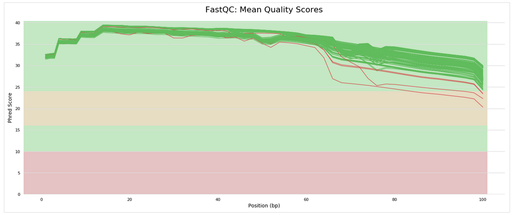
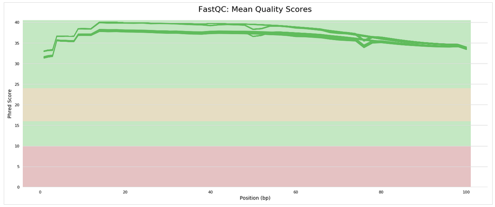
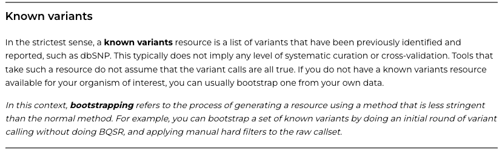
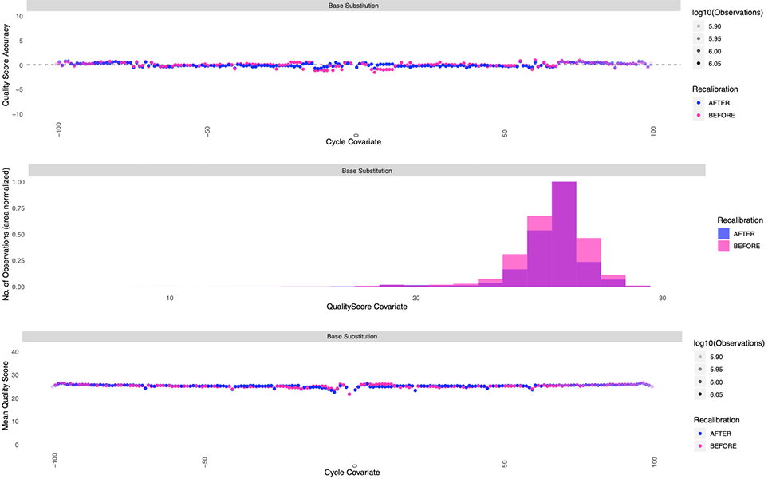

# Bioinformatic Piplines for sequence variants and gene expression.

Pipeline for processing "raw" genomic data (whole-genome sequencing, RNA sequencing, and target-capture sequencing)
_This code was used for data processing and analyses in Klabacka et al. (in prep)_

---

## Contents

-   [Project Background](#project-background)
-   [README Orientation](#readme-orientation)
-   [Study Design](#study-design)
-   [Bioinformatics](#bioinformatics)

---

# <a name="project-background"></a>
## Project Backround

Studying factors driving natural variation in life-history strategies can help us understand how senescence evolves. Divergent ecotypes (slow-aging and fast-aging) of western terrestrial garter snake (Thamnophis elegans) provide a useful model system for examination of these factors. Here we examine gene expression and population genetics within and between these divergent ecotypes, and find support for hypothesized life-history divergence at the molecular level. We store our code for data processing and analyses, along with documentation for reproduction, within this repository.

---

# <a name="readme-orientation"></a>
## README Orientation

This README contains code description, code blocks, and images. The code blocks for commands implemented from a shell script are formatted for bash, and will have no prompt.

```
This is an example of a code block for bash
```

Code blocks that are formatted for python will have a ```>>>``` prompt.

```
>>> This is an example of a code block for python
```

The code blocks may not match the code within the files exactly- they have been simplified to avoid confusion (e.g., no loops, parallelization, or variable names are used in the code blocks). To see more-detailed implementation, refer to the script files.

---

# <a name="study-design"></a>
## Study Design

#### Quantifying Gene Expression
32 individuals born and raised in the lab used within a 2 x 2 experimental design with heat treatment (27º C and 37º C) and ecotype (FA and SA) as variables.
#### Examining Targeted Sequence Variation
243 individuals genotyped for variant sites within 301 targeted genes (252 within networks of interest, 49 randomly selected)
Data for 94 of these individuals were sequenced using a target capture approach (Seq-Cap)
Data for 31 of these individuals were sequenced using a transcriptomic approach (RNA-Seq)
Data for 118 of these individuals were sequenced using a whole-genome approach (WGS)
We called SNPs using the Seq-Cap and RNA-Seq individuals, and then used this database to call SNPs from the same sites for the WGS individuals.

---

# <a name="bioinformatics"></a>
## Bioinformatics

### Bioinformatics Summary

Summarize bioinformatics here

-   [Gene Expression](#gene-expression)
-   [Sequence Variation](#sequence-variation)

# <a name="gene-expression"></a>
### Gene Expression via RNA-seq

#### Workflow
 Bioinformatioc processing of each RNAseq dataset. The script below process each dataset seperately, mapping to the T. elegans genome.  (methods)

-   [RNAseq 2008 ](#q.CleanMapCount_HiSat2-Ballgown_2008_Final.sh)

# <a name="sequence-variation"></a>
### Sequence Variation

#### Scripts & Files
Scripts and coding files used for examination of targeted sequence variation are within the 'Examining-Sequence-Variation' directory. Here is a brief overview:

-   'q.main.sh' : This script executes functions from all other bash scripts for complete data processing.
-   'reads2vcf.sh' : This file contains functions for processing raw reads from RNA-Seq and Seq-Cap (cleaning, mapping, etc.) and calling SNPs 
-   'SNP_curation.sh' : This file contains functions for joining WGS data with Seq-Cap and RNA-Seq data, parsing SNPs into pairwise population files, inserting SNPs into multiple sequence alignments, calculating Tajima's D for each gene, and obtaining SNP proportions for their respective genes, transcripts, and coding regions.
-   'sift2vcf.sh' : This file contains functions for quantifying the functional implications of nonsynonymous SNPs and inserting these into a vcf.

#### Workflow
Bioinformatic pipelines can be complex and complicated. Here I will describe the general workflow, providing descriptions where some detail is necessary. For a more-detailed description, reading through the scripts/files themselves (and potentially documentation for the tools/packages used) may be necessary.

-   [Raw Reads to Mapped Alignment](#raw-reads-2-mapped-alignment)
-   [Mapped Alignment to Variant Calls](#raw-reads-2-variant-calls)
-   [Variant Call Processing & Filtration](#variant-call-processing)

# <a name="raw-reads-2-mapped-alignment"></a>
1.  Raw Reads to Mapped Alignment

    We begin with raw '.fastq' files which we received from the genomic sequencing company. We need to clean these reads to (A) remove the adapter sequence and (B) remove low-quality information that may be incorrect due to sequencing error. To do this, we first check the quality using the program [FastQC](https://www.bioinformatics.babraham.ac.uk/projects/fastqc/). 

```
fastqc Sample_R1.fastq.gz
```

This program provides information about our reads, including position-specific quality scores, read-wide quality scores, and adapter content. Below is an example of the position quality scores for our Seq-Cap reads 


You'll notice that the quality of each base call ([Phred score](https://en.wikipedia.org/wiki/Phred_quality_score)] decreases toward the end of the reads. The FastQC output (an html file) contains many other plots to help assess read quality. To clean up our reads and remove the sequence adapters (which were used for binding, sequence initiation, and indexing), we use the program [Trimmomatic](http://www.usadellab.org/cms/?page=trimmomatic). This program will clean up our reads using our specified parameters.

```
# Paired-end sequencing reads:
   java -jar /tools/trimmomatic-0.36/trimmomatic-0.36.jar \
     PE \
     -threads 6 \
     -phred33 \
     Sample_R1.fastq.gz \             # Forward raw read
     Sample_R2.fastq.gz \             # Reverse raw read
     Cleaned_R1_paired.fastq.gz \   # Cleaned R1 read with pair found
     Cleaned_R1_unpaired.fastq.gz \ # Cleaned R1 read without pair found
     Cleaned_R2_paired.fastq.gz \   # Cleaned R1 read with pair found
     Cleaned_R2_unpaired.fastq.gz \ # Cleaned R1 read without pair found 
     ILLUMINACLIP:adapters.fa:2:30:10 LEADING:25 TRAILING:25 SLIDINGWINDOW:6:30 MINLEN:36

# Single-end sequencing reads:
   java -jar /tools/trimmomatic-0.37/bin/trimmomatic.jar \
     SE \
     -threads 6 \
     -phred33 \
     Sample_.fastq.gz  \
     Sample_cleaned.fastq.gz \
     LEADING:20 TRAILING:20 SLIDINGWINDOW:6:20 MINLEN:36
```

Following read cleaning, we check the read quality again using fastqc. This time our position quality scores for our Seq-Cap reads look much better


After cleaning our reads, we are ready to map them to a reference. This can be challenging from a study design perspective; the decision for how to map can be a tricky one. If you have a reference genome for your focal taxon, you can simply map to this. Alternatively, you can map to a transcriptome or the genome of a closely-related species. For our study, we mapped to a reference genome. We map our cleaned reads using two approaches:


(1) for our reads from Seq-Cap, we mapped using the program [BWA](https://hpc.nih.gov/apps/bwa.html).
```
# Index reference genome for bwa
    bwa index -p ReferenceGenome -a bwtsw ReferenceGenome.fasta
# Mapping DNA paired-end reads
    bwa mem \
	-t 4 \
	-M ReferenceGenome \
        Sample_R1_paired.fastq.gz \
        Sample_R2_paired.fastq.gz > \
        Sample_mapped.sam
```

(2) for our reads from RNA-Seq, we used [HiSat2](http://daehwankimlab.github.io/hisat2/). This required preparing the reference (indexing, extracting splice sites, extracting exons)

```
extract_splice_sites.py ReferenceGenome.gtf > ReferenceGenome.ss  # This is a python script within the hisat2 alignment toolkit
extract_exons.py ReferenceGenome.gtf > ReferenceGenome.exon       # This is a python script within the hisat2 alignment toolkit
# Index reference
hisat2-build -ss ReferenceGenome.ss --exon ReferenceGenome.exon ReferenceGenome.fasta ReferenceGenome_hisatIndex
# Map reads
hisat2 -p 20 --dta -x ReferenceGenome_hisatIndex -U Sample_cleaned.fastq.gz -S Sample_mapped.sam
```

You can then compress and sort the .sam files to .bam files using [Samtools](https://www.htslib.org/)

```
samtools view -@ 2 -bS Sample_mapped.sam | samtools sort -@ 2 -o Sample_sorted.bam
  
```


The approach you take depends on your nucleotide type and sequencing approach (e.g., reads from single-end sequencing should be treated differently than those from paired-end sequencing). Mapping will use the clean .fastq files to create a [.sam (sequence alignment map)](https://en.wikipedia.org/wiki/SAM_(file_format)) file. These can be converted to the compressed version, .bam, using [Samtools](https://www.htslib.org/) to increase downstream processing efficiency.

# <a name="raw-reads-2-variant-calls"></a>
2.  Mapped Alignment to Variant Calls

    Once reads have been mapped and stored in an alignment file, variation at specific positions can be identified. To prepare for variant calling, it is important to identify reads that might be duplicates (e.g., from PCR). We mark these duplicates using the MarkDuplicates tool from [Picard](https://gatk.broadinstitute.org/hc/en-us/articles/360037052812-MarkDuplicates-Picard-).

    After marking duplicates, we perform a round of variant calling. For this project, we are specifically interested in single nucleotide polymorphisms (SNPs) that we can identify using various tools within the software package [GATK](https://gatk.broadinstitute.org). We follow the [GATK best practices workflow for germline short variant discovery](https://gatk.broadinstitute.org/hc/en-us/articles/360035535932-Germline-short-variant-discovery-SNPs-Indels-) and implement suggestions regarding [base score recalibration](https://gatk.broadinstitute.org/hc/en-us/articles/360035890531-Base-Quality-Score-Recalibration-BQSR-) in non-model organisms. Like many software packages, GATK is updated regularly. We used version [4.1.7](https://gatk.broadinstitute.org/hc/en-us/articles/360042912311--Tool-Documentation-Index), but advise others to be aware that changes in versions may affect functionality/outcomes.

    First, we call variants using [HaplotypeCaller](https://gatk.broadinstitute.org/hc/en-us/articles/360042913231-HaplotypeCaller). We then create a variant database and select only SNPs using [GenomicsDBImport](https://gatk.broadinstitute.org/hc/en-us/articles/360042477052-GenomicsDBImport), [GenotypeGVCFs](https://gatk.broadinstitute.org/hc/en-us/articles/360042914991-GenotypeGVCFs), and [SelectVariants](https://gatk.broadinstitute.org/hc/en-us/articles/360042913071-SelectVariants). During this process, we go from having a vcf for each sample (HaplotypeCaller uses the .bam file to create a .vcf for each individual) to a single .vcf for the full sample set (GenomicsDBImport creates a SNP database using all of the individuals, which is then used to create the .vcf with GenotypeGVCFs). We then use [VariantFiltration](https://gatk.broadinstitute.org/hc/en-us/articles/360042477652-VariantFiltration) to select SNPs we identify with high confidence.

    Next, we perform what GATK developers refer to as "bootstrapping" (not to be confused with statistical bootstrapping). The idea behind this suggestion is described in the screenshot below.



We use our high-confidence SNPs to generate a recalibration table (table_0) with our .bam file using [BaseRecalibrator](https://gatk.broadinstitute.org/hc/en-us/articles/360042477672-BaseRecalibrator). We then perform base score recalibration to create a new .bam file using [ApplyBQSR](https://gatk.broadinstitute.org/hc/en-us/articles/360042476852-ApplyBQSR). With this new .bam file, we repeat the variant calling process described above (with the exception of variant filtration) and create another recalibration table (table_1). We then compare table_0 with table_1 using [AnalyzeCovariates](https://gatk.broadinstitute.org/hc/en-us/articles/360042911971-AnalyzeCovariates). This tool outputs a pdf that compares assigned quality scores and their accuracy between table_0 and table_1 within each individual. Here is an example of the exported plots


We repeat the above until it appears that that the scores converge. This process uses machine learning to model systematic (non-random) errors in Phred score assignment. Each iteration uses the high-confidence SNPs to update the scores within the .bam files. Ideally this would be done using a database of high-confidence SNPs previously collected. However, this is not an option for many non-model organisms (thus the "bootstrapping" suggestion by GATK). We performed this process for both Seq-Cap and RNA-Seq datasets independently, resulting in a vcf file for each. Here is what the plots will look like once convergence is reached


# <a name="variant-call-processing"></a>
3.  Variant Call Processing & Filtration 

    With .vcf files for both Seq-Cap and RNA-Seq datasets, we are now ready to merge these files. We do this using the 'merge' utility within the software package (bcftools)[https://samtools.github.io/bcftools/bcftools.html]. Using an abbreviated annotation file specific to our targeted genes (created using blast tools implemented in the function probes2gff within the reads2vcf.sh code file), we annotated and extracted the merged SNPs from our target genes using the bcftools 'annotate' utility and an awk command. We then performed variant filtration within the annotated .vcf using the software packages [GATK](https://gatk.broadinstitute.org), [vcftools](http://vcftools.sourceforge.net/) and [bcftools](https://samtools.github.io/bcftools/bcftools.html). Let's break these steps down:

* First we use the ```initial-VariantFiltration``` function to filter based on recommendations from the GATK best practices. This includes filtering out sites with SOR (estimated strand bias without penalizing reads that occur at the end of exons) > 3.0, QD (variant confidence divided by raw depth at a site) < 2.0, MQ (Root mean square mapping quality over all the reads at the site) < 40.0, MQRankSum (Compares mapping qualities of reads supporting the reference allele tot hose supporting the alternate allele) < -12.5, FS (Phred-scaled probability of strand bias) > 60.0, and ReadPosRankSum < -5.0. 

```
  /tools/gatk-4.1.7.0/gatk --java-options "-Xmx16g" VariantFiltration \
        -R $WorkingDirectory/References/TelagGenome.fasta \
        -V "$1" \
        -O "$2"_Init.vcf \
        --filter-name "SOR" \
        --filter-expression "SOR > 3.0" \
        --filter-name "QD" \
        --filter-expression "QD < 2.0" \
        --filter-name "MQ" \
        --filter-expression "MQ < 40.0" \
        --filter-name "MQRankSum" \
        --filter-expression "MQRankSum < -12.5" \
        --filter-name "FS" \
        --filter-expression "FS > 60.0" \
        --filter-name "ReadPosRankSum" \
        --filter-expression "ReadPosRankSum < -5.0"
```

* Then we used the ```hard-VariantFiltration``` function to further filter the VCF based on our determined criteria. One common area of confusion with VCF filtering is the object of filtration. Some commands filter the site (meaning the entire locus is removed), whereas other commands filter genotypes (meaning a single sample's genotype for a site is removed). We perform six steps of site and genotype filtration: 


  .....(i) remove low-quality genotypes
```
    vcftools --vcf original.vcf --out HardFilterStep1 --minGQ 20 --recode --recode-INFO-all
    mv HardFilterStep1.recode.vcf HardFilterStep1.vcf # we rename here because vcftools added "recode" to the vcf
```
  .....(ii) remove low-depth genotypes
```
    vcftools --vcf HardFilterStep1.vcf --out HardFilterStep2 --minDP 10 --recode --recode-INFO-all
    mv HardFilterStep2.recode.vcf HardFilterStep2.vcf
```
  .....(iii) remove genotypes from individuals who are duplicates/siblings/other species 
```
    vcftools --remove Full_IndividualsToRemove.txt --vcf HardFilterStep2.vcf --out HardFilterStep3 --recode --recode-INFO-all 
    mv HardFilterStep3.recode.vcf HardFilterStep3.vcf
```
  .....(iv) remove sites with multiple alleles [more than 2]
```
    bcftools view -m2 -M2 -v snps HardFilterStep3.vcf > HardFilterStep4.vcf
```
  .....(v) remove sites where the alt allele is represented by a single individual (singletons)
```
    vcftools --mac 2 --vcf HardFilterStep4.vcf --recode --recode-INFO-all --out HardFilterStep5
    mv HardFilterStep5.recode.vcf HardFilterStep5.vcf
```
  .....(vi) remove sites missing high amounts of data ( > 70%)
```
    vcftools --max-missing 0.3 --vcf HardFilterStep5.vcf --recode --recode-INFO-all --out HardFilterStep6
    mv HardFilterStep6.recode.vcf HardFilterStep6.vcf
```

Finally, we can pull out the SNPs within exons and those within coding regions and put these within their own files using bcftools 'annotate' utility in with our specified annotation files as input. We finish this step with three files: SeqCap_Genes.vcf, SeqCap_Exons.vcf, and SeqCap_CDS.vcf (while these files are prefixed with 'SeqCap', they also include SNPs from the RNA-Seq dataset).

    At each filtering step, we quantified the number of SNPs in the output VCF. The results are as follows:

| Step |                     filtering settings                          |    n   |
|:----:|:---------------------------------------------------------------:|:------:|
|  0   | Pre-filter                                                      | 70,177 |
|  I   | GATK Best Practices: SOR, QD, MQ, MQRankSum, FS, ReadPosRankSum | 64,648 |
|  II  | Remove individual genotypes with low GQ or low DP               | 64,648 |
|  III | Remove multi-allelic SNPs                                       | 63,000 |
|  IV  | Remove singletons                                               | 21,898 |
|  V   | Remove sites with high amounts of missing data                  | 12,512 |

# <a name="SNP-curation"></a>
4.  SNP Curation
    
    With the filtered set of SNPs from Seq-Cap and RNA-Seq (stored in the .vcf), we use the bcftools 'merge' utility to combine this dataset with the whole-genome sequencing (WGS) dataset. We then perform a functional annotation using the software package [snpEff](https://pcingola.github.io/SnpEff/), which annotates each variant as "missense" or "synonymous." This is somewhat redundant, because a software package we use downstream (SIFT) also annotates the variants. However, we include this step to reduce the size of the dataset before using SIFT.
    
    Using a custom python script (parseBED.py) and the bcftools 'view' utility, we create a .vcf for each gene (this is done within the getGeneVariants function in SNP_curation.sh, which calls the getBEDbyGene and getVCFbyGene functions. These .vcf files are then used to create fasta files in the vcf2faa function in SNP_curation. This function takes the .vcf for a given gene and uses the GATK tools 'SelectVariants' to pull out sample-specific sites (creating a .vcf for each sample) and 'FastaAlternateReferenceMaker' to insert the SNPs into the reference genome (creating a .fasta for each sample). We then use [bedtools](https://bedtools.readthedocs.io/en/latest/index.html) to perform two subsequent operations within a single command: (1) we use the tool 'genomecov' with the sample-specific .bam file (mapped in the [Raw Reads to Mapped Alignment](#raw-reads-2-mapped-alignment) section) to obtain site-specific depth information for the individual sample, and (2) we use the tool 'maskfasta' to mask sites with read depth < 2. We then use the program [gffread](https://github.com/gpertea/gffread) to reduce the newly-masked fasta file so that it contains only our targeted genes. Lastly, we translate the fasta file using a custom python script (parseAndTranslate.py).
